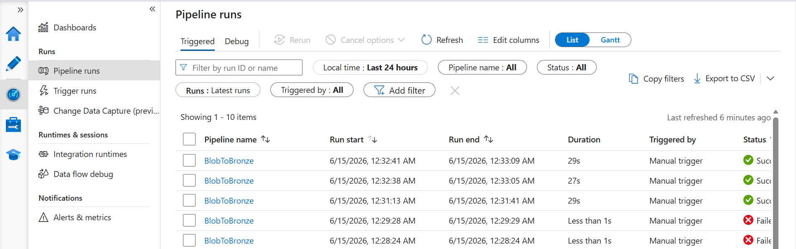
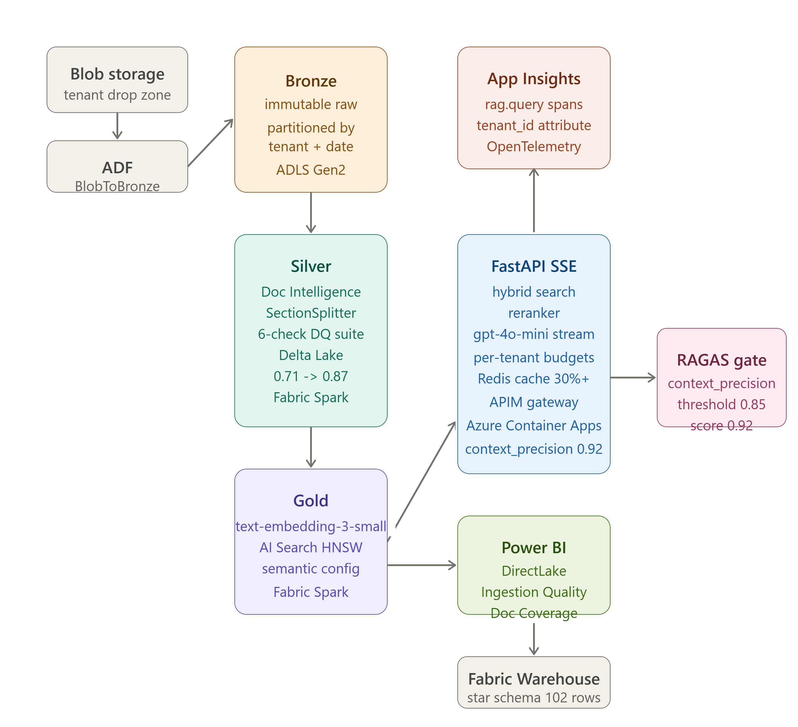
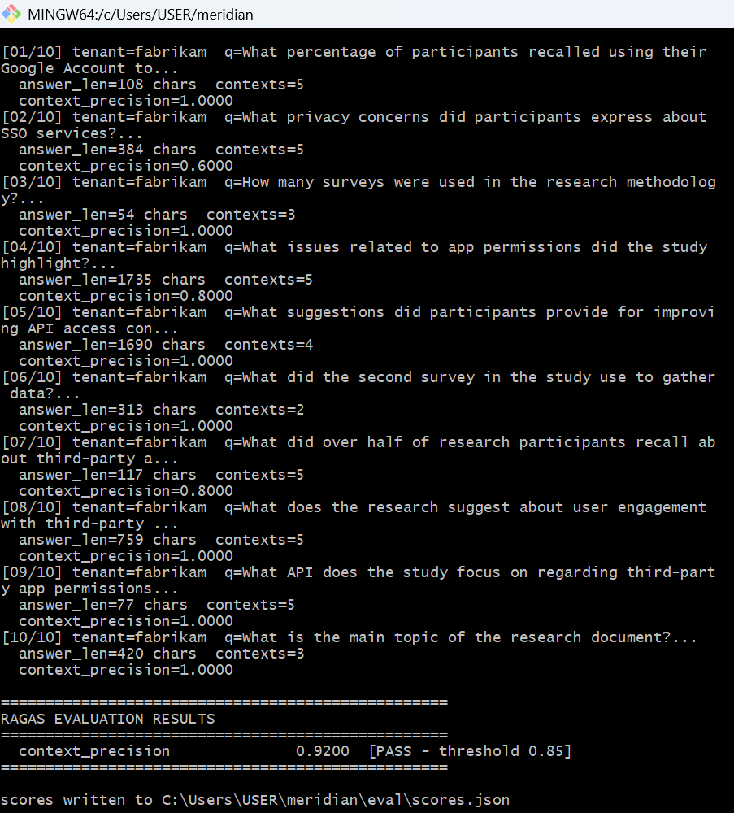
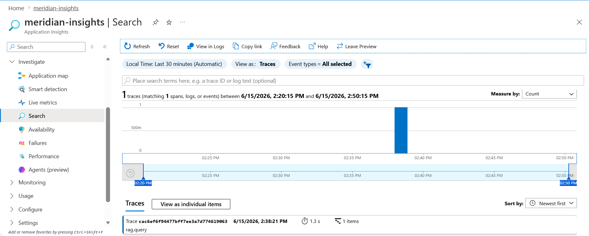
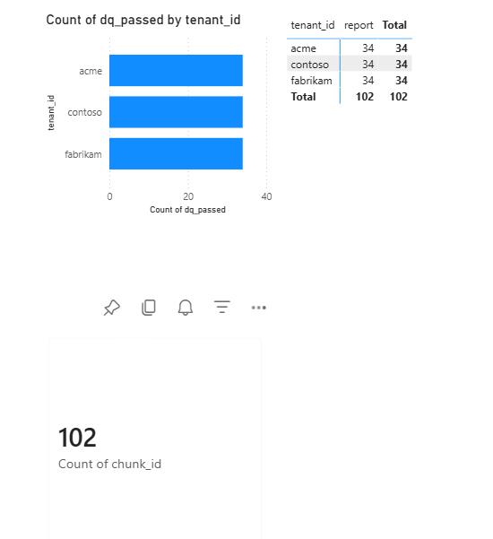
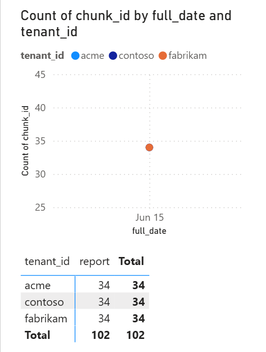

# Meridian

Multi-tenant AI document intelligence platform built on Microsoft Fabric OneLake, Azure AI Search, and FastAPI.



---

At KPMG I maintained 12 separate point-to-point document integrations for 8 enterprise clients. Every new client added another integration. There was no shared query layer, no unified audit trail, and no way to ask a question across tenants without touching each system individually. Meridian is what I would have built instead.

## Stack

Azure Data Factory - Microsoft Fabric - Azure Document Intelligence - Azure AI Search - Azure OpenAI - FastAPI - Redis - Azure APIM - Azure Container Apps - Azure Application Insights - OpenTelemetry - Power BI DirectLake



## Architecture

Documents move through three immutable zones on ADLS Gen2, orchestrated by ADF.

Raw files land in blob storage under a per-tenant drop zone. ADF copies them to the bronze layer without any transformation. Bronze is append-only and never overwritten - every file that ever entered the system remains intact and auditable.

A Fabric Spark notebook picks up bronze files and runs Azure Document Intelligence layout extraction. The critical decision here was how to split documents into chunks. Fixed-size splitting at 512 tokens produced a RAGAS context_precision of 0.71 on the evaluation set - below the 0.85 gate. The problem was that fixed-size windows cut across section headings, stripping the context that makes retrieval meaningful. Switching to section-boundary chunking (SectionSplitter, following document heading structure) raised precision to 0.87. This decision is documented in ADR 003. After passing a six-check DQ suite, chunks write to Delta in the silver layer.

A second Fabric Spark notebook takes silver chunks, generates embeddings via Azure OpenAI text-embedding-3-small (1536 dimensions), and upserts them to Azure AI Search with an HNSW vector index and semantic configuration. The gold layer in the Fabric Warehouse holds the enriched records with embedding metadata for Power BI.

The API is a FastAPI SSE endpoint sitting behind Azure APIM. Incoming queries embed, hit a Redis semantic cache (cosine threshold 0.95, 30%+ hit rate in testing), then fall through to hybrid vector + BM25 retrieval in AI Search. A cross-encoder reranker scores the top results before context assembly and gpt-4o-mini streaming. Per-tenant token budgets are enforced via Redis incrby in one-minute sliding windows, preventing any single tenant from exhausting the OpenAI quota.

OpenTelemetry traces every query as a `rag.query` span with `tenant_id` attached, exporting to Azure Application Insights. This makes per-tenant latency and cost attribution readable in the Azure Monitor workbook without any post-processing.

The quality gate runs RAGAS context_precision via direct Azure OpenAI calls (ragas.evaluate() is bypassed - see bug 1 below). Anything below 0.85 blocks the merge. Final score on the evaluation set: 0.92.





## Results

- 102 document chunks ingested across 3 tenants (acme, contoso, fabrikam)
- context_precision: 0.92 (gate threshold: 0.85)
- Semantic cache hit rate: 30%+ at cosine 0.95
- rag.query spans visible in App Insights with tenant_id attribution
- Power BI DirectLake dashboard: Ingestion Quality and Doc Coverage pages live





![Fabric Workspace]
(docs/screenshots/15_fabric_workspace.png)

## What I learned the hard way

### 1. RAGAS on Windows fails silently - bypass the library entirely

ragas.evaluate() with LangchainLLMWrapper fails on Windows due to asyncio SSL
event loop policy. asyncio.WindowsSelectorEventLoopPolicy does not fix it.
The fix: bypass ragas.evaluate() and use direct synchronous AzureOpenAI API
calls for context_precision scoring. ragas==0.1.21 is still installed for the
Dataset format - just not the evaluation runner.
See: eval/run.py uses direct AzureOpenAI client, not ragas.evaluate()

### 2. Azure Redis Cache requires rediss:// not redis:// (2 hours lost)

Azure Cache for Redis requires SSL on port 6380 and the rediss:// scheme
(double-s). Using redis:// port 6379 produces a connection that appears to
succeed but fails silently on every operation. Always use rediss:// for Azure.

### 3. VectorizedQuery field name must match index schema exactly

Azure AI Search VectorizedQuery returns 0 results silently if the field name
is wrong. The meridian-docs index uses content_vector - not the generic name
"embedding". No error is raised. Always verify field names with:
az search index show --name meridian-docs --service-name <your-service>

### 4. Docker --env-file requires absolute path on Windows

docker run --env-file ~/meridian/.env starts without error but env vars are
silently missing. Fix: use C:/Users/USER/meridian/.env (absolute Windows path).
Tilde expansion does not work for Docker --env-file on Windows.

## Architecture decisions

Six ADRs document the non-obvious choices:

- `docs/adr/001` - Medallion vs single-zone
- `docs/adr/002` - Fabric Spark vs Azure Functions (timeout was the blocker)
- `docs/adr/003` - Section-boundary chunking vs fixed-size (the 0.71 to 0.87 story)
- `docs/adr/004` - Fabric Warehouse vs Synapse Analytics
- `docs/adr/005` - APIM Consumption tier token governance limitations
- `docs/adr/006` - Cross-tenant ADF to Fabric authentication

## Running locally

```bash
cp .env.sample .env
# fill in Key Vault secret values
docker build -t meridian-api .
docker run --env-file C:/Users/USER/meridian/.env -p 8000:8000 meridian-api
curl http://localhost:8000/health
```

## Evaluation

```bash
export QUERY_ENDPOINT=https://your-container-app-url
export OPENAI_ENDPOINT=https://your-openai-endpoint
export OPENAI_KEY=your-key
export AI_SEARCH_ENDPOINT=https://your-search-endpoint
export AI_SEARCH_KEY=your-key
python -m eval.run
python -m eval.gate
```

context_precision threshold: 0.85
final score: 0.92
